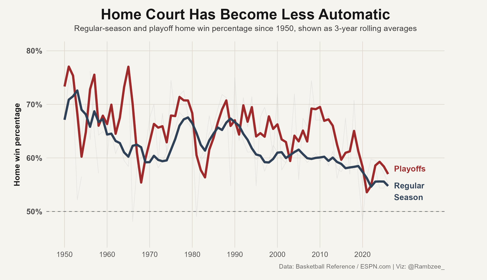
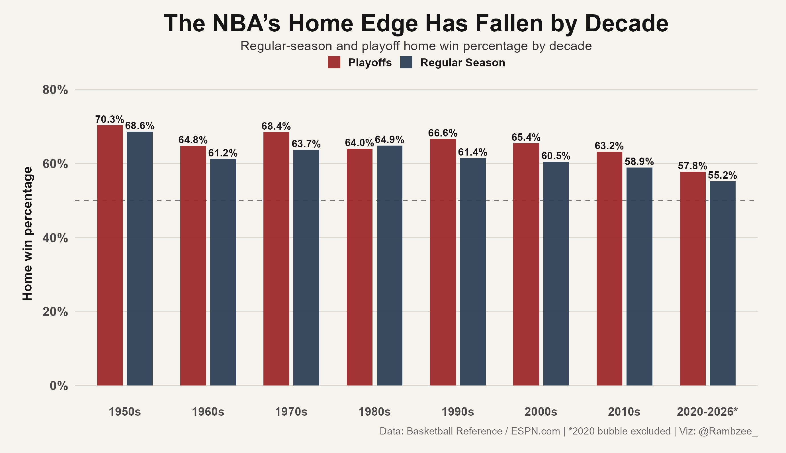
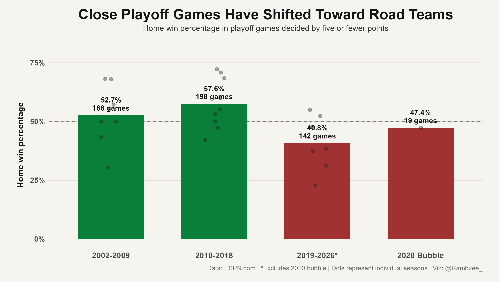
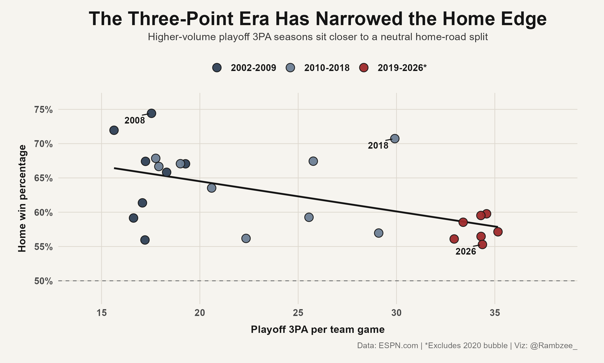
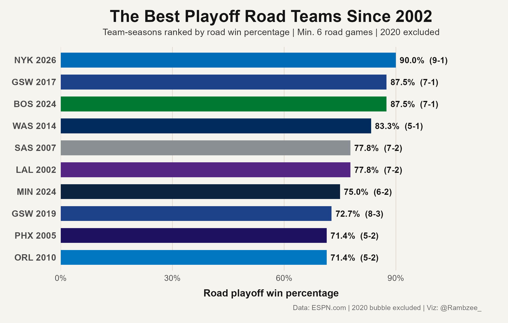

```{r setup, include=FALSE}
knitr::opts_chunk$set(
  echo = FALSE,
  warning = FALSE,
  message = FALSE,
  fig.align = "center",
  out.width = "100%"
)

library(tidyverse)
library(janitor)
library(scales)
library(knitr)
library(kableExtra)
library(glue)

theme_set(theme_minimal())

# Modern playoff data
season_home_road <- read_csv("../data/processed/playoff_home_road_by_season.csv") %>%
  clean_names()

era_summary <- read_csv("../data/processed/playoff_home_road_by_era.csv") %>%
  clean_names()

round_era_home_road <- read_csv("../data/processed/playoff_home_road_by_round_era.csv") %>%
  clean_names()

home_road_3pa <- read_csv("../data/processed/playoff_home_road_3pa_by_season.csv") %>%
  clean_names()

best_road_teams <- read_csv("../data/processed/best_playoff_road_teams.csv") %>%
  clean_names()

# Long-view home/road data
all_home_road_by_season <- read_csv("../data/processed/nba_home_road_by_season_1950_2026.csv") %>%
  clean_names()
```

# Introduction

Home court has always been one of basketball’s built-in advantages.

The home team gets the building, the routine, the crowd, and the comfort. Role players settle in faster. Runs are louder. Opponents have to play through travel, noise, and the weight of a game that is not being played on their terms.

For a long time, the numbers matched the assumption. Across NBA history, home teams held a clear advantage in both the regular season and the playoffs. But that edge has been shrinking.

The league is deeper now. Shooting is better. More teams have enough creation to survive bad stretches away from home. There is not one clean explanation; the game has changed. Home court still matters, but it does not dictate games the way it once did.

That shift becomes even more evident in the playoffs. From 2002-2018, home teams won 64.7% of NBA playoff games. Since 2019, excluding the 2020 bubble, that number has fallen to 57.6%.

Still an advantage, but not the same one. This report dives into how home court has changed, where the drop shows up most clearly, and why road teams are harder to bury than they used to be.

# Home Court Has Become Less Automatic

The long view is where the shift starts to show.

```{r home-trend-figure}

```

Home-court advantage has been real across NBA history, but it has slowly moved closer to neutral. In earlier decades, both the regular season and playoffs lived much higher above 50%. The playoff line jumps around more because the sample is smaller, but the direction still matches the bigger league trend.

```{r decade-figure}

```

The decade view makes that decline harder to miss. Playoff home teams were regularly winning in the mid-to-high 60s across earlier eras. In the 2020s, excluding the bubble, that number is down to 57.8%. The regular season has moved in the same direction, falling to 55.2%.

# Close Games Have Shifted Toward Road Teams

Close games are where home court is supposed to matter most. The crowd is louder, every call feels like it's life-or-death, and one run can turn a tight finish into a building-wide avalanche.

That has not been the recent pattern.

```{r close-games-figure}

```

From 2002-2009, home teams won 52.7% of playoff games decided by five or fewer points. From 2010-2018, that rose to 57.6%. Since 2019, excluding the 2020 bubble, home teams have won only 40.8%.

The sample is smaller, so this should not be treated like the new norm. But it is one of the clearest signs that the old home-court edge has changed. The exact games that used to tilt toward the crowd are now the ones road teams are finding ways to steal.

# More Threes Are Part of the Story

The three-point boom is the easiest place to look first. A few threes can erase a home run, quiet a building, and leave road offense less dependent on grinding through gritty possessions. In that sense, no shot is a better silencer.

But the three-point line is probably not the whole story. It is more useful as a marker of a larger shift in the game.

```{r three-pa-figure}

```

The relationship is not perfect. 2018 is the obvious outlier, and part of that is because the Warriors were an all-time team stampeding through everyone in front of them. That is exactly why this should not be treated as a clean cause-and-effect chart. Still, the cluster matters. When playoff teams were taking fewer than 20 threes per game, home win percentage often sat in the mid-to-high 60s. As playoff 3PA has moved into the mid-30s, recent seasons have landed much closer to a neutral home-road split.

Threes alone have not killed home court, but modern shot diets have made road offense less fragile than it used to be.

# Does the Advantage Shine in Later Rounds?

The round-level split adds an important layer. If home court still separates teams, the later rounds should be a good place to find it. By then, the matchups are tighter, the margins are thinner, and one extra home game can be the difference between controlling a series and watching it slip away.

For most of the modern sample, that held up. From 2002-2009, home teams won 59.1% of Conference Finals games and 67.4% of NBA Finals games. From 2010-2018, those marks were 67.0% and 61.5%.

Since 2019, excluding the 2020 bubble, the late-round edge has nearly flattened: 51.3% in the Conference Finals and 52.5% in the NBA Finals.

The samples are smaller, so this should not be treated as definitive on its own, but it fits the broader pattern. As the playoff field gets stronger, the best road teams have become more capable of playing through the things home court used to exaggerate.

```{r round-late-table}
round_era_home_road %>%
  filter(
    round %in% c("Conference Finals", "NBA Finals"),
    era %in% c("2002-2009", "2010-2018", "2019-2026*")
  ) %>%
  mutate(
    home_win_pct = percent(home_win_pct, accuracy = 0.1),
    road_win_pct = percent(road_win_pct, accuracy = 0.1),
    close_home_win_pct = percent(close_home_win_pct, accuracy = 0.1)
  ) %>%
  select(
    Period = era,
    Round = round,
    Games = games,
    `Home Win%` = home_win_pct,
    `Road Win%` = road_win_pct,
    `Close Home Win%` = close_home_win_pct
  ) %>%
  kbl(
    booktabs = TRUE,
    caption = "Home/road results in later playoff rounds"
  ) %>%
  kable_styling(
    full_width = TRUE,
    font_size = 10.5,
    position = "center"
  )
```

# The Best Modern Road Teams

If road teams have become more dangerous, the next question is which teams best represent that shift. This list ranks team-seasons by road playoff win percentage since 2002, with a minimum of six road games and the 2020 bubble excluded.

```{r best-road-teams-figure}

```

# What Home Court Means Now

Home court still matters. It gives teams an extra game, a familiar atmosphere, and a crowd behind the biggest possessions.

But the cushion is smaller than it used to be.

Modern road teams have more ways to hold up. Shooting creates quicker paths back into games. Spacing and creation keep bad stretches from turning into avalanches. Depth gives coaches more lineups that can survive uncomfortable minutes. The old home-court edge could turn one run into control of the night; now, more teams are built to play through it.

That shift is notable. Home court still gives teams an edge, but it does not cover as much as it once did. The best teams can travel, keep their offense intact, and make the building matter less.